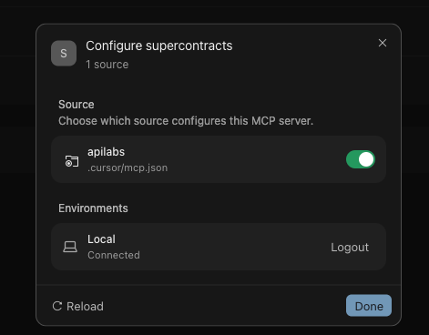
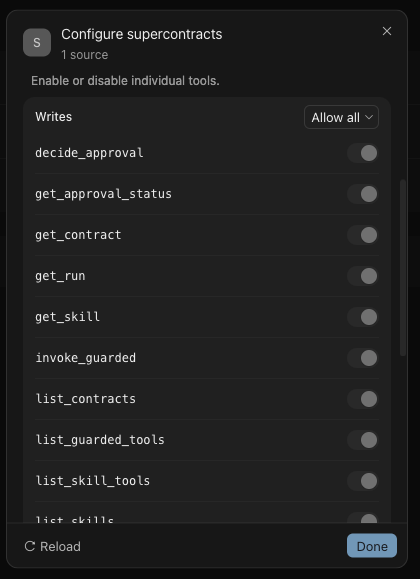

# Run Your First SuperContract

Start with a read-only contract. Each example makes one safe provider request and verifies that the provider returns HTTP `200`.

| Provider | Ask your AI agent | Contract | Test name |
| --- | --- | --- | --- |
| GitHub | “List my repositories.” | [`github-read-repositories.yml`](./github-read-repositories.yml) | `github_read_repositories` |
| Gmail | “Show my 5 most recent emails.” | [`gmail-read-emails.yml`](./gmail-read-emails.yml) | `gmail_read_recent_emails` |
| Google Calendar | “Show my upcoming events.” | [`google-calendar-read-events.yml`](./google-calendar-read-events.yml) | `google_calendar_read_upcoming_events` |

## Before you run

1. Connect your AI client to the SuperContracts MCP bridge using the [main Quickstart](../README.md#quickstart).
2. In API Labs **Auth Vault**, connect the provider you want to use.
3. Copy the provider credential ARN into that contract's `auth.secret_arn`.
4. Save the YAML in **API Contract Model**. Keep the saved `connection_id`.
5. For Google Calendar, replace `CHANGE_ME_CURRENT_RFC3339_TIMESTAMP` with the current time, for example `2026-10-02T10:00:00+05:30`.

Required access:

- GitHub: token with permission to read the authenticated user's repositories.
- Gmail: Google OAuth with `gmail.readonly` access.
- Google Calendar: Google OAuth with Calendar read-only access.

The MCP token used by Cursor is separate from these provider credentials. Never commit a real token, OAuth credential, or secret ARN.

## Run from Cursor

Use the GitHub example for the first demo because it has no date input and returns a short, recognizable result.

### Confirm the MCP connection

Open Cursor's MCP settings and confirm that the `supercontracts` server shows **Connected**.

<p align="center">
  
</p>

Open the server configuration and verify that its tools include `list_contracts`, `get_contract`, `run_contract`, and `get_run`. A connected status without a populated tool list is not sufficient verification.

<p align="center">
  
</p>

### 1. Load the saved contract

Ask Cursor:

```text
Use SuperContracts to find the saved quick-start contract for reading GitHub repositories.
Call get_contract and show me its test names. Do not run it yet.
```

Cursor should use `list_contracts`, then `get_contract`, and return the test name `github_read_repositories`.

### 2. Run the contract

Ask Cursor:

```text
Run the github_read_repositories test from the contract you just loaded.
Use the complete contract_yaml returned by get_contract and the same connection_id.
Show the expected-versus-actual assertion and the repositories returned.
```

Cursor should call `run_contract` with:

- the complete `contract_yaml` returned by `get_contract`
- the same `connection_id`
- test `github_read_repositories`

Expected result:

```text
Step: repositories
Expected status: 200
Actual status: 200
Result: PASS
```

The response contains up to 10 repositories, sorted by most recently updated.

> Before publishing a screenshot or recording, mask MCP tokens, provider Secret ARNs, connection IDs, private repository names, and other account-specific data.

### 3. Inspect the evidence

Ask Cursor:

```text
Use get_run with the returned run_id and summarize the saved evidence.
```

The run should contain the request, response, status assertion, step result, and run metadata.

## Important execution rule

For saved contracts, always follow:

```text
list_contracts → get_contract → run_contract → get_run
```

Do not reconstruct or shorten the YAML after `get_contract`. Pass its complete `contract_yaml` and the same `connection_id` to `run_contract` so the execution and artifacts remain associated with the saved contract.
